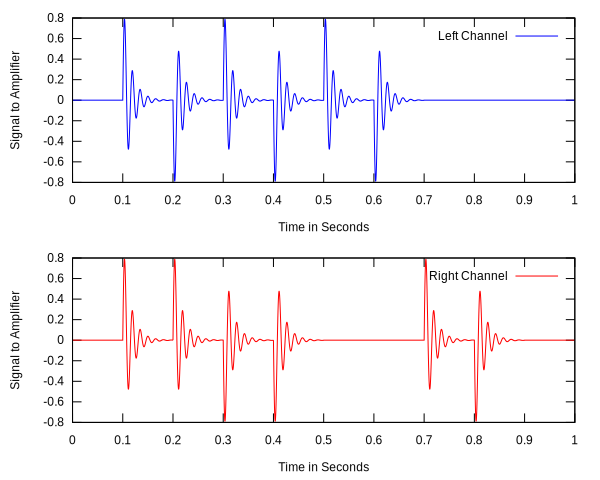

# Bump Wavefile generator

This mini project was conceived for testing a faulty Yamaha Stagepas300 amplifier that cuts out during music performances at seemingly random times.

It was discovered eventually that sometimes a severe bump on a microphone input would make the amplifier fail. I hate to bump expensive microphones hard, so this project creates a wave file that simulates a hard microphone bump. A rapidly decaying 64.5Hz waveform.

Eventually a smoking gun was found. The negative supply IC804 TOP249Y pin 2 is connected to the 340V rail via two 1M Ohm resistors R829,R830 in series. The resistors are SMD 0402 normally rated at 50V. Their value appears to have reduced to 850k Ohm each, causing the switched mode supply to enter over voltage shutdown mode at 243V RMS mains input voltage. The cure is to replace the low voltage SMD resistors with two wire ended 1M Ohm 1/4 watt resistors rated at 250V.

The Class D amplifier output is monitored for DC offset by Q812 and opto coupler PC802 fed by a low pass filter R860,R861, R877 and C848. This circuit seems to be tuned to detect microphone bump positive excursions! Note that the left and right power amplifiers operate in anti-phase. So this bump generator software generates bumps on left and right channels in all combinations of phase between channels.

The amplifier passed the synthetic bump test at 251V mains input voltage with replacement 1M resistors.
